# Project Graph

## Project Structure Diagram

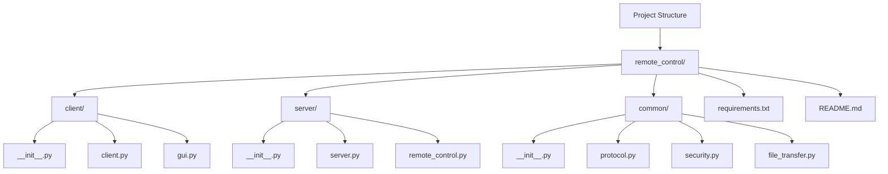

## Architecture Flow

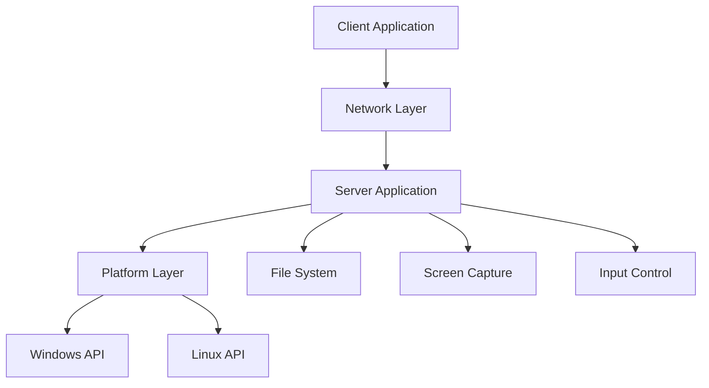

## Communication Flow

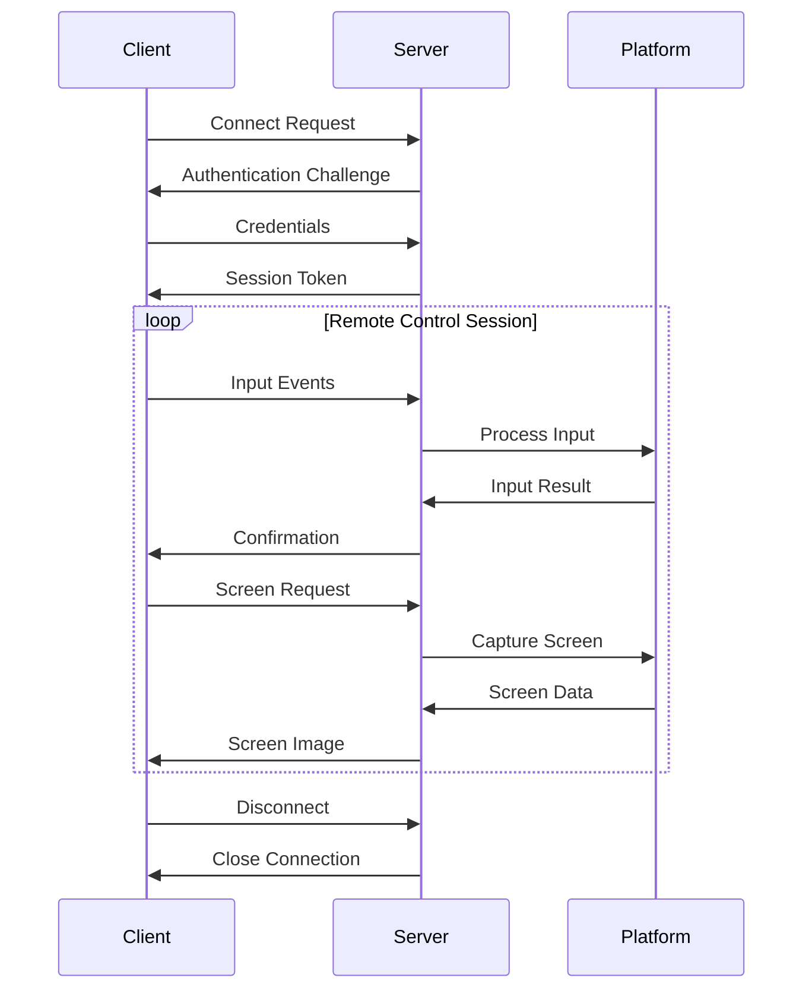

## Component Dependencies

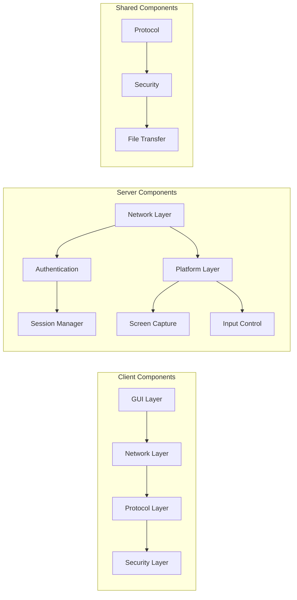

## Data Flow Architecture

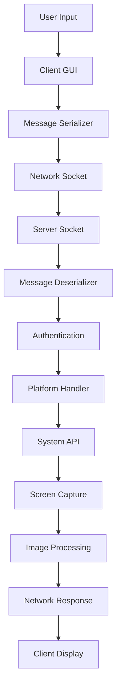

## Platform Abstraction

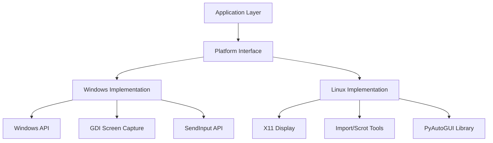

## Security Architecture

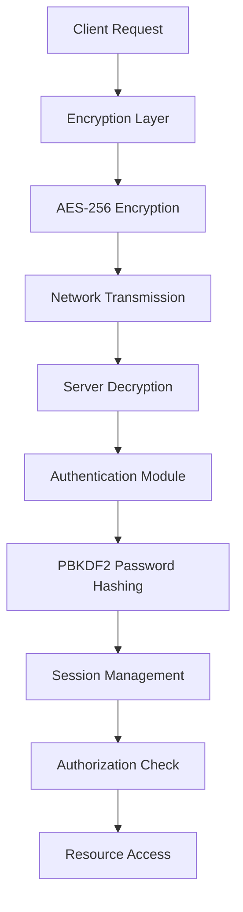

## File Transfer Flow

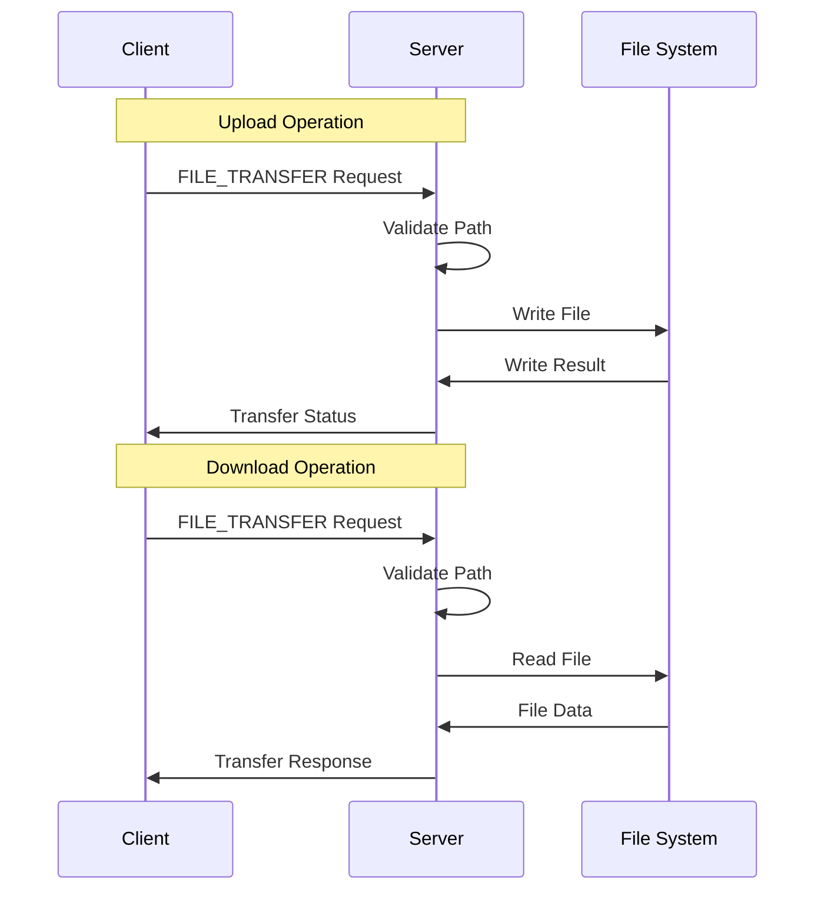

## Performance Optimization Flow

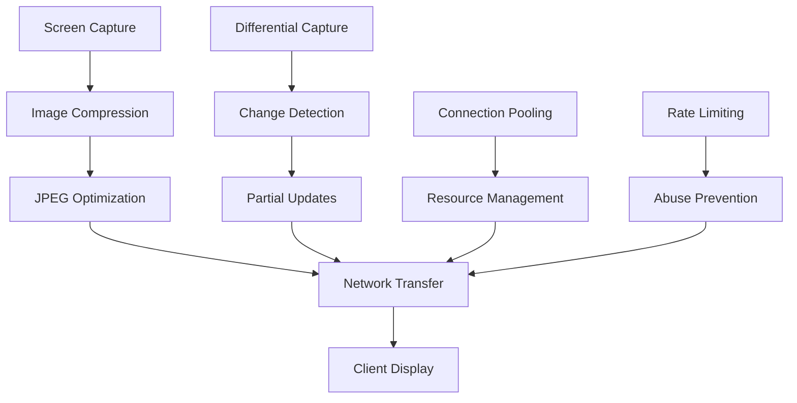

## Module Interaction Graph

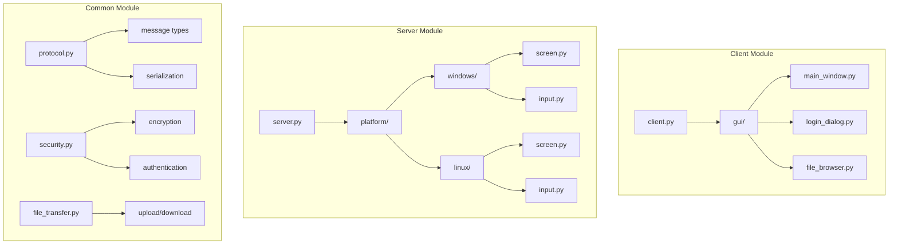

## Build System Graph

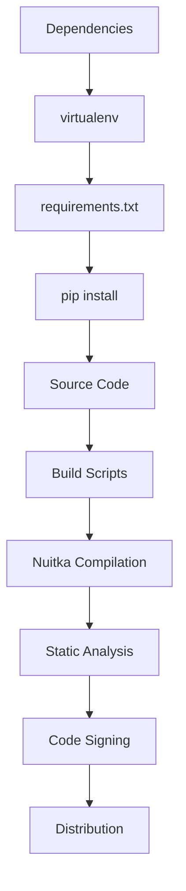

## Deployment Architecture

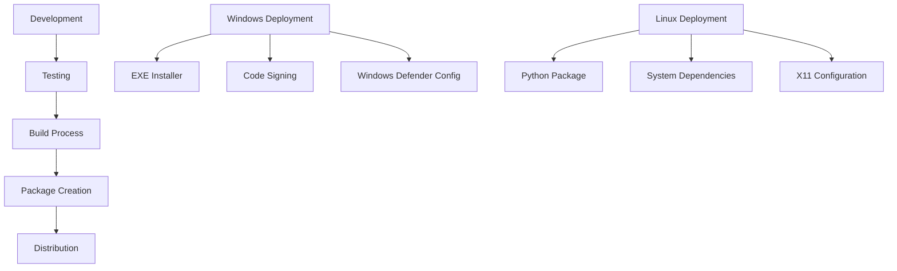

---

**Last Updated**: December 26, 2025  
**Version**: 1.0.0  
**License**: GPLv3
