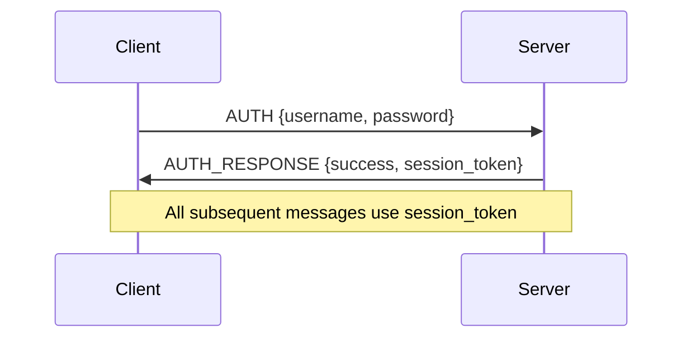
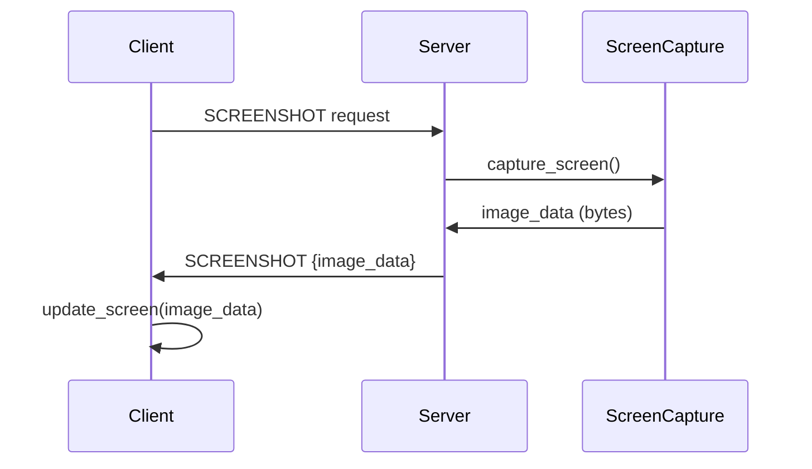
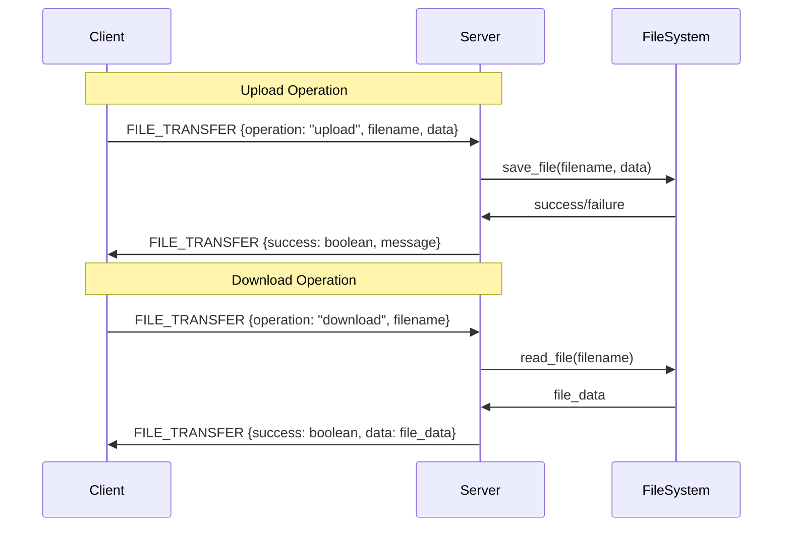

# Technical Reference

## Table of Contents
1. [Architecture Overview](#architecture-overview)
2. [Communication Protocol](#communication-protocol)
3. [Message Types](#message-types)
4. [Platform Implementations](#platform-implementations)
5. [Security Architecture](#security-architecture)
6. [Performance Optimization](#performance-optimization)
7. [API Reference](#api-reference)

## Architecture Overview

### System Components

```
┌─────────────────┐    ┌─────────────────┐    ┌─────────────────┐
│   Client       │    │    Server       │    │   Platform      │
│                 │    │                 │    │   Layer         │
│ ┌─────────────┐ │    │ ┌─────────────┐ │    │ ┌─────────────┐ │
│ │ GUI Layer   │ │    │ │ Network Layer │ │    │ │ Windows API  │ │
│ │             │ │    │ │             │ │    │ │ Linux API    │ │
│ └─────────────┘ │    │ └─────────────┘ │    │ └─────────────┘ │
└─────────────────┘    └─────────────────┘    └─────────────────┘
```

### Client Architecture

```python
class RemoteControlClient(QMainWindow):
    """Main client application with layered architecture."""
    
    def __init__(self):
        # GUI Layer
        self.setup_ui()
        
        # Network Layer
        self.client_socket = None
        self.receive_thread = None
        
        # Protocol Layer
        self.message_handlers = {
            MessageType.SCREENSHOT: self.handle_screenshot,
            MessageType.ERROR: self.handle_error,
            # ... other handlers
        }
        
        # Security Layer
        self.session_token = None
        self.encryption_key = None
```

### Server Architecture

```python
class RemoteControlServer:
    """Main server with modular architecture."""
    
    def __init__(self):
        # Network Layer
        self.server_socket = None
        self.client_handlers = {}
        
        # Platform Layer
        self.screen_controller = self._get_screen_controller()
        self.input_controller = self._get_input_controller()
        
        # Security Layer
        self.authenticator = Authenticator()
        self.session_manager = SessionManager()
```

## Communication Protocol

### Binary Protocol Specification

#### Message Structure
```
+----------------+----------------+------------------+
|  Message Type  |  Data Length   |      Data        |
|    (4 bytes)   |   (4 bytes)    |   (N bytes)      |
+----------------+----------------+------------------+
```

#### Byte Order
- **Big Endian**: All multi-byte values use big-endian
- **Network Order**: Most significant byte first
- **Compatibility**: Ensures cross-platform compatibility

#### Message Types
```python
class MessageType(IntEnum):
    AUTH = 1           # Authentication request
    AUTH_RESPONSE = 2    # Authentication response
    SCREENSHOT = 3       # Screen capture data
    MOUSE_MOVE = 4       # Mouse movement
    MOUSE_CLICK = 5       # Mouse click event
    KEY_EVENT = 6         # Keyboard input
    FILE_TRANSFER = 7     # File operations
    CLIPBOARD_UPDATE = 8  # Clipboard content
    SYSTEM_COMMAND = 9    # System commands
    INFO = 10            # System information
    DISCONNECT = 11       # Graceful disconnect
    ERROR = 12            # Error messages
    PING = 13            # Keepalive ping
    PONG = 14            # Keepalive pong
```

### Serialization Format

#### Authentication Message
```python
# Request format
{
    "username": "string",
    "password": "hashed_string"
}

# Response format
{
    "success": boolean,
    "message": "string",
    "session_token": "string"  # Only on success
}
```

#### Mouse Event Message
```python
# Movement format (binary)
struct.pack('>hh', x, y)  # int16, int16

# Click format (binary)
struct.pack('>hhBB', x, y, button, pressed)
# button: 0=left, 1=middle, 2=right
# pressed: 0=released, 1=pressed
```

#### Keyboard Event Message
```python
{
    "key": "string",      # Key identifier
    "pressed": boolean,     # True=down, False=up
    "modifiers": [          # Optional modifier keys
        "ctrl", "shift", "alt"
    ]
}
```

## Message Types

### Authentication Flow



### Screen Capture Flow



### File Transfer Flow



## Platform Implementations

### Windows Platform

#### Screen Capture Architecture
```python
class WindowsScreenCapture:
    """Windows-specific screen capture using GDI."""
    
    def __init__(self):
        # GDI handles
        self.desktop_hwnd = win32gui.GetDesktopWindow()
        self.desktop_dc = win32ui.CreateDCFromHandle(self.desktop_hwnd)
        self.memory_dc = win32ui.CreateCompatibleDC(self.desktop_dc)
        self.bitmap = win32ui.CreateCompatibleBitmap(
            self.desktop_dc, width, height
        )
        
    def capture_screen(self) -> bytes:
        # Capture screen to bitmap
        old_bitmap = win32ui.SelectObject(self.memory_dc, self.bitmap)
        win32gui.BitBlt(self.memory_dc, 0, 0, width, height, 
                        self.desktop_dc, 0, 0, win32con.SRCCOPY)
        win32ui.SelectObject(self.memory_dc, old_bitmap)
        
        # Convert to numpy array
        bmp_info = win32ui.GetObject(self.bitmap)
        bmp_str = win32api.GetBitmapBits(self.bitmap, bmp_info.bmBits)
        img_array = numpy.frombuffer(bmp_str, dtype=numpy.uint8)
        
        # Convert to PNG using wand
        with wand.image.Image.from_array(img_array.reshape(height, width, 4)) as img:
            return img.make_blob("png")
```

#### Input Control Architecture
```python
class WindowsInputHandler:
    """Windows-specific input using SendInput API."""
    
    def send_mouse_click(self, x, y, button, double):
        # Create input structure
        input_type = win32con.INPUT_MOUSE
        mouse_data = win32con.MOUSEINPUTF_ABSOLUTE
        
        # Set coordinates and button
        if button == 'left':
            mouse_data |= win32con.MOUSEEVENTF_LEFTDOWN
        elif button == 'right':
            mouse_data |= win32con.MOUSEEVENTF_RIGHTDOWN
            
        # Create input event
        input_event = win32con.INPUT(type=input_type, mi=win32con.MOUSEINPUT(
            dx=x, dy=y, mouseData=mouse_data, dwFlags=mouse_data, time=0
        ))
        
        # Send input
        win32api.SendInput(1, ctypes.byref(input_event), ctypes.sizeof(win32con.INPUT))
```

### Linux Platform

#### Screen Capture Architecture
```python
class LinuxScreenCapture:
    """Linux-specific screen capture using X11."""
    
    def __init__(self):
        # X11 display connection
        self.display = None
        self.screen = None
        self.supported = self._check_dependencies()
        
    def capture_screen(self) -> bytes:
        if not self.supported:
            return None
            
        try:
            # Try import command first
            result = subprocess.run([
                'import', '-window', 'root', '-screen', 'png', '-'
            ], capture_output=True, timeout=5)
            
            if result.returncode == 0:
                return result.stdout
                
            # Fallback to scrot
            result = subprocess.run([
                'scrot', '-f', 'png', '-'
            ], capture_output=True, timeout=5)
            
            return result.stdout if result.returncode == 0 else None
            
        except (subprocess.TimeoutExpired, FileNotFoundError):
            return None
```

#### Input Control Architecture
```python
class LinuxInputHandler:
    """Linux-specific input using pyautogui."""
    
    def __init__(self):
        # Initialize pyautogui
        pyautogui.FAILSAFE = False
        self.supported = self._check_dependencies()
        
    def send_mouse_click(self, x, y, button, double):
        if not self.supported:
            return False
            
        try:
            # Move to position
            pyautogui.moveTo(x, y)
            
            # Perform click
            if button == 'left':
                pyautogui.click()
            elif button == 'right':
                pyautogui.rightClick()
            elif button == 'middle':
                pyautogui.middleClick()
                
            return True
        except Exception:
            return False
```

## Security Architecture

### Encryption Implementation

#### AES-256 Encryption
```python
from cryptography.hazmat.primitives.ciphers import Cipher, algorithms, modes
from cryptography.hazmat.backends import default_backend

class AESEncryption:
    """AES-256 encryption for network communication."""
    
    def __init__(self, key: bytes):
        self.key = key
        self.cipher = Cipher(
            algorithms.AES(key),
            modes.CBC(),
            backend=default_backend()
        )
        
    def encrypt(self, plaintext: bytes) -> bytes:
        # Generate random IV
        iv = os.urandom(16)
        
        # Create encryptor
        encryptor = self.cipher.encryptor(iv)
        
        # Pad data
        padder = padding.PKCS7(128).padder()
        padded_data = padder.update(plaintext) + padder.finalize()
        
        # Encrypt
        ciphertext = encryptor.update(padded_data) + encryptor.finalize()
        
        # Return IV + ciphertext
        return iv + ciphertext
        
    def decrypt(self, ciphertext: bytes) -> bytes:
        # Extract IV and ciphertext
        iv = ciphertext[:16]
        actual_ciphertext = ciphertext[16:]
        
        # Create decryptor
        decryptor = self.cipher.decryptor(iv)
        
        # Decrypt and unpad
        padded_plaintext = decryptor.update(actual_ciphertext) + decryptor.finalize()
        unpadder = padding.PKCS7(128).unpadder()
        return unpadder.update(padded_plaintext) + unpadder.finalize()
```

#### Password Hashing
```python
from cryptography.hazmat.primitives import hashes
from cryptography.hazmat.primitives.kdf.pbkdf2 import PBKDF2HMAC
import os

class PasswordHasher:
    """PBKDF2 password hashing with salt."""
    
    def __init__(self, iterations: int = 100000):
        self.iterations = iterations
        
    def hash_password(self, password: str, salt: bytes = None) -> dict:
        # Generate salt if not provided
        if salt is None:
            salt = os.urandom(32)
        else:
            salt = salt
            
        # Derive key
        kdf = PBKDF2HMAC(
            algorithm=hashes.SHA256(),
            length=32,
            salt=salt,
            iterations=self.iterations,
        )
        
        key = kdf.derive(password.encode('utf-8'))
        
        return {
            'hash': key.hex(),
            'salt': salt.hex(),
            'iterations': self.iterations
        }
```

### Session Management

```python
class SessionManager:
    """Secure session token management."""
    
    def __init__(self):
        self.active_sessions = {}
        self.session_timeout = 3600  # 1 hour
        
    def create_session(self, user_id: str) -> str:
        # Generate secure token
        token = secrets.token_urlsafe(32)
        expires = time.time() + self.session_timeout
        
        self.active_sessions[token] = {
            'user_id': user_id,
            'expires': expires,
            'created': time.time()
        }
        
        return token
        
    def validate_session(self, token: str) -> bool:
        session = self.active_sessions.get(token)
        if not session:
            return False
            
        # Check expiration
        if time.time() > session['expires']:
            del self.active_sessions[token]
            return False
            
        return True
```

## Performance Optimization

### Image Compression

#### JPEG Compression Settings
```python
class ImageCompressor:
    """Optimize image compression for network transfer."""
    
    def __init__(self, quality: int = 75):
        self.quality = quality  # 1-100 (higher = better quality)
        
    def compress_screenshot(self, image_data: bytes) -> bytes:
        with wand.image.Image(blob=image_data) as img:
            # Convert to RGB if needed
            if img.alpha_channel:
                img.alpha_channel = False
                img.background_color = wand.image.Color('white')
                
            # Compress as JPEG
            img.format = 'jpeg'
            img.compression_quality = self.quality
            
            return img.make_blob()
```

#### Differential Updates
```python
class DifferentialCapture:
    """Optimize screen capture with differential updates."""
    
    def __init__(self):
        self.last_frame = None
        self.frame_hash = None
        
    def capture_differential(self) -> tuple:
        current_frame = self.capture_screen()
        
        if self.last_frame is None:
            self.last_frame = current_frame
            self.frame_hash = self.calculate_hash(current_frame)
            return ('full', current_frame)
            
        # Calculate differences
        if self.frame_changed(current_frame):
            self.last_frame = current_frame
            self.frame_hash = self.calculate_hash(current_frame)
            return ('diff', self.calculate_diff(current_frame, self.last_frame))
            
        return ('none', None)
```

### Network Optimization

#### Connection Pooling
```python
class ConnectionPool:
    """Manage multiple network connections efficiently."""
    
    def __init__(self, max_connections: int = 10):
        self.max_connections = max_connections
        self.active_connections = []
        self.connection_queue = []
        
    def get_connection(self, host: str, port: int):
        # Reuse existing connection
        for conn in self.active_connections:
            if conn.is_connected_to(host, port) and not conn.is_busy():
                return conn
                
        # Create new connection if available
        if len(self.active_connections) < self.max_connections:
            conn = self.create_connection(host, port)
            self.active_connections.append(conn)
            return conn
            
        return None
```

#### Rate Limiting
```python
class RateLimiter:
    """Prevent abuse with rate limiting."""
    
    def __init__(self, max_requests: int, time_window: int):
        self.max_requests = max_requests
        self.time_window = time_window
        self.requests = []
        
    def is_allowed(self) -> bool:
        current_time = time.time()
        
        # Remove old requests
        self.requests = [
            req_time for req_time in self.requests
            if current_time - req_time < self.time_window
        ]
        
        # Check if under limit
        if len(self.requests) < self.max_requests:
            self.requests.append(current_time)
            return True
            
        return False
```

## API Reference

### Core Classes

#### RemoteControlClient
```python
class RemoteControlClient(QMainWindow):
    """Main client application class."""
    
    # Constructor
    def __init__(self):
        """Initialize client with default settings."""
        
    # Connection Management
    def connect_to_server(self, host: str, port: int, username: str, password: str) -> bool:
        """Connect to remote server with authentication."""
        
    def disconnect_from_server(self, show_message: bool = True) -> None:
        """Disconnect from server and cleanup resources."""
        
    # Message Handling
    def send_message(self, msg_type: MessageType, data: bytes) -> bool:
        """Send message to server."""
        
    def handle_message(self, msg_type: MessageType, data: bytes) -> None:
        """Handle incoming message from server."""
        
    # UI Methods
    def update_screen(self, image_data: bytes) -> None:
        """Update screen display with received image data."""
        
    def toggle_fullscreen(self) -> None:
        """Toggle between fullscreen and windowed mode."""
```

#### RemoteControlServer
```python
class RemoteControlServer:
    """Main server application class."""
    
    # Constructor
    def __init__(self, host: str = "0.0.0.0", port: int = 5000):
        """Initialize server with network configuration."""
        
    # Server Management
    def start(self) -> None:
        """Start listening for client connections."""
        
    def stop(self) -> None:
        """Stop server and cleanup resources."""
        
    # Client Handling
    def handle_client(self, client_socket: socket.socket, client_address: tuple) -> None:
        """Handle individual client connection."""
        
    # Message Processing
    def process_message(self, msg_type: MessageType, data: bytes, client_socket) -> Tuple[MessageType, bytes]:
        """Process incoming message from client."""
```

### Utility Functions

#### Message Serialization
```python
def serialize_message(msg_type: MessageType, data: bytes) -> bytes:
    """Serialize message with header."""
    header = struct.pack('>II', msg_type.value, len(data))
    return header + data

def deserialize_message(data: bytes) -> Tuple[MessageType, bytes]:
    """Deserialize message from bytes."""
    if len(data) < 8:
        raise ValueError("Message too short")
        
    msg_type = MessageType(struct.unpack('>I', data[:4])[0])
    msg_length = struct.unpack('>I', data[4:8])[0]
    
    if len(data) < 8 + msg_length:
        raise ValueError("Incomplete message")
        
    message_data = data[8:8 + msg_length]
    return msg_type, message_data
```

#### Error Handling
```python
class RemoteControlError(Exception):
    """Base exception for remote control errors."""
    
    def __init__(self, message: str, error_code: int = None):
        super().__init__(message)
        self.error_code = error_code
        self.message = message

class ConnectionError(RemoteControlError):
    """Connection-related errors."""
    pass

class AuthenticationError(RemoteControlError):
    """Authentication-related errors."""
    pass

class ScreenCaptureError(RemoteControlError):
    """Screen capture errors."""
    pass
```

---

**Last Updated**: December 26, 2025  
**Version**: 1.0.0  
**License**: GPLv3  
**For API details**: See [API.md](API.md)
